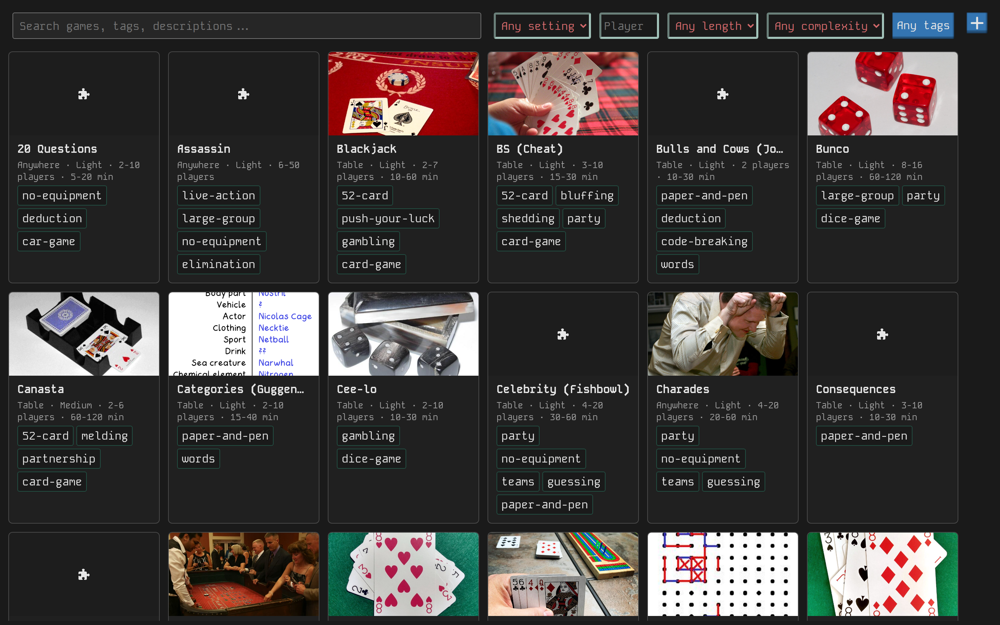

# game-night

A searchable library of games: 52-card classics, board games, video games, and homemade ones, built to answer "what should we play tonight?"



Five people and half an hour? Filter by player count, play time, setting (`Table` / `Couch` / `Outside` / `Anywhere`), complexity, tags, and fuzzy search across names, descriptions, and tags. Filter state lives in the URL, so a filtered view is shareable.

Every game gets its own page:

- **Rules & description**: markdown, with tables, `[!NOTE]` alerts, and a side-by-side live editor
- **Pictures**: shown on the card and in a detail gallery
- **Attachments**: rulebook pdfs, reference txt/md files
- **Links**: one per line, optionally labeled (`Label | https://...`)
- **Related games**: pin them by name, the rest are suggested by tag overlap

A fresh install seeds itself with 60+ ready-to-play classics, rules included, covers fetched in the background. Own a Steam library? Import it: covers, descriptions, and genre tags land automatically.

## Usage

```sh
bun i
bun run dev # development on http://localhost:8034
bun start   # production
bun test
```

Data lives in `~/.gameNight.json` (override with `--database`); pictures and attachments in a sibling `~/.gameNight-files/` folder. Default port is `8034` (override with `--port`).

Run it as a background service:

```sh
bun run service:enable  # systemd user unit on linux, launchd agent on macos
bun run service:reload  # after pulling changes + bun run build
```

## Stack

- [Bun](https://bun.sh) server with a tiny request-matching router
- [lowdb](https://github.com/typicode/lowdb) JSON database
- [@vanilla-bean/components](https://www.npmjs.com/package/@vanilla-bean/components) UI
- [@vanilla-bean/hypertether](https://www.npmjs.com/package/@vanilla-bean/hypertether) client data layer
